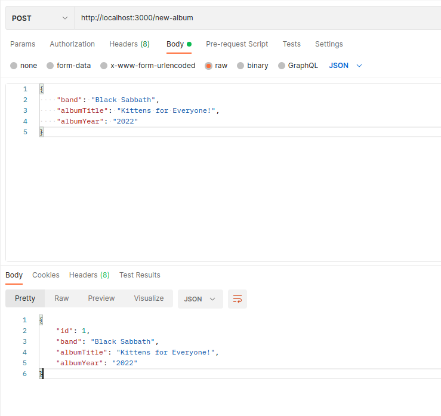

# Express - Testing POST requests with Postman

Let's build a server which can handle POST requests. In the `body` of each POST request, the server should receive details of a **music album**, in the form of JSON data, and store each album before sending back a response.

**Note:** For now we will just store the album details in an array. We will soon have the chance to hook our server up to a real MongoDB database. :-)

At this stage, we will test our server's ability to handle POST requests using **Postman**.

### Instructions

1. Install the Postman app and register for an account (if you haven't already).
2. Create an Express server in `index.js`.
3. Create an empty array called `albums`. This will hold the details of all albums posted while the current server process is running.
4. Create one route in your server to handle `post` requests made to the "/new-album" path.
5. Your route should expect to find JSON data in the `body` of the request. This data should be an object with the following properties:

>- band
>- albumTitle
>- albumYear

**Remember:** Your server will need to be able to **parse** any JSON data it receives in the POST request - we already looked at middleware which can do this for you!

6. Your route should take the "album" object received, add an extra property ("id") and add it to the `albums` array.

7. Finally, your route should send a response back to the client.  This should have a "201" status code ("created success"), and (2) contain the new album object (including the new "id" property) in a JSON format.

8. Finally, start your server and use the Postman app to test your "/new-album" route. Make sure you are getting the response you expect when you POST JSON data to the route.

## Example:

---

**Bonus**

9. If you have some extra time, create another route, serving a **GET** request to the "/albums" endpoint. When this endpoint receives a request it should send a response containing the `albums` array in a JSON format. Test the route using Postman and make sure you are getting the response you expect (especially after you POST some albums using the "/new-album" route).

10. If you like, you can also create a final route to the "/" endpoint. When this endpoint receives a request, it should send as a response a simple string: "Welcome to my albums page!" Test the route using Postman.